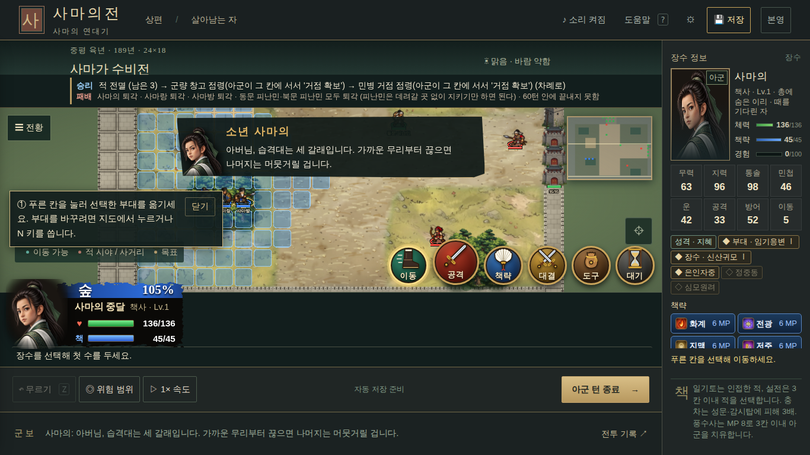
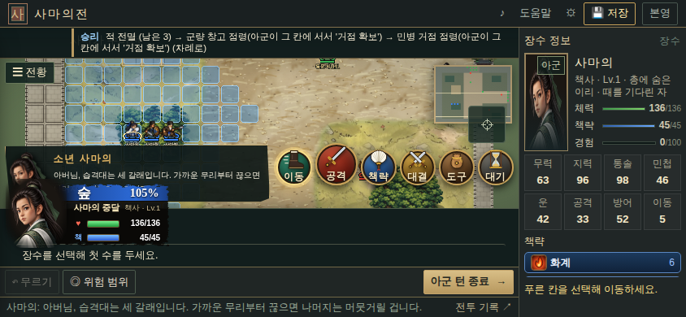

# 01. 전투 화면 UI

- **대상:** 전투 지도(`#map`), 승리·패배 조건(`#map-objective`), 장수 카드(`#unit-hud`), 안내 줄(`#tile-info`), 명령 단추(`#action-dock`), 첫 전투 안내(`#coach`), 전투 대사 띠(`#battle-line`)
- **코드:** `packages/web/src/main.ts`, `packages/web/src/style.css`, `packages/web/src/battlefield.ts`(카메라 `fit()`)

## 규격

| 항목 | 기준 |
|---|---|
| 지도 높이 | 화면 높이에서 머리줄·도구줄·군보를 뺀 공간의 **최소 70%**. 1366×768에서 지도 높이 **480px 이상**, 1920×1080에서 **800px 이상**, 844×390에서 **260px 이상** |
| 승리 조건 | 전투 시작(1턴 아군 차례)에 펼쳐 보이고, 장수를 처음 고르거나 8초가 지나면 한 줄 꼬리표 `◇ 목표 ▾`로 접는다. 누르면 다시 펼친다. 목표가 바뀌면 다시 펼쳤다 접는다 |
| 목표 지점 깜박임 | 승리 조건에 **위치 목표**(탈출·도착·점령)가 있으면 전투 시작에 그 칸을 **6초 동안 깜박인다**. 칸 위에 `탈출 · 남문 ▼`처럼 이름표를 띄운다(색: 탈출 청록, 도착 노랑, 점령 주황). 이름표 글자는 화면에서 16px 아래로 줄지 않는다 |
| 목표 비추기 | 목표 칸이 화면 밖이면 카메라가 0.6초에 걸쳐 그쪽으로 가서 약 2.6초 머문 뒤 원래 자리로 돌아온다. 그사이 플레이어가 화면을 끌면 돌아오지 않는다. 전투 연출 중에는 카메라를 옮기지 않는다 |
| 목표를 덮지 않기 | 목표를 비추는 동안 승리 조건 상자가 목표 칸이나 이름표를 덮으면 반대쪽으로 옮긴다. 그래도 덮으면 접고, 접힌 꼬리표마저 덮으면 깜박임이 끝날 때까지 감춘다 |
| 목표 칸 모양 | 목표 칸은 **띄우지 않고 붙인다**. 탈출 지점은 **6칸(3×2 또는 2×3), 최소 4칸** — 함께 탈출할 장수가 다 설 수 있어야 한다. 남문은 성문 3칸 + 바로 안쪽 3칸. 합류·도착 지점은 지도와 같은 비율(1.5배)로 넓힌다. 상륙 지점은 물길 2칸, 점령 목표는 원래 크기. 넓은 전장으로 늘릴 때 코드가 다시 놓는다(`stretch.ts`의 `shapeGoals`) |
| 누가 가야 하는가 | 탈출·도착해야 하는 장수는 전투 내내 **머리 위 꼬리표(탈출 청록·도착 노랑)**와 발밑 고리, 같은 색 이름표를 단다. 깜박이는 목표 이름표에도 `조조 탈출 / 야곡 출구`처럼 이름을 쓴다. 승리 조건은 `조조가 야곡 출구까지 탈출` |
| 목표 이름표 위치 | 칸 위에 단다. 지도 위·아래 끝(4줄 안)의 목표는 잘리거나 작은 지도·대사 상자에 가리므로 칸 옆(지도 안쪽)에 `◀`·`▶`로 단다 |
| 지형이 바뀌는 칸 | 부교·다리·수문 길·홍수 지역은 늘린 지도에서 빈틈없이 채운다(가운데가 물로 남으면 안 된다) |
| 승리 조건 문장 | 여러 승리 조건은 아무거나 하나면 되므로 **"또는"**으로 잇는다. 같은 곳에 여럿이 가야 하면 "사마의·사마랑이 모두 남문에 도달", 한 명만 가면 되면 "셋 중 한 명이". 대화·사건 조건에는 언제 나오는지와 그 뒤 새 목표를 괄호로 적는다 |
| 장수 카드 | 고른 장수와 지금 노리는 대상을 덮지 않는다. 카드가 지도 위에 올라오면 카메라를 밀어 유닛을 카드 밖으로 꺼낸다 |
| 명령 단추 | 고른 장수와 공격 대상 칸을 덮지 않는다 |
| 첫 전투 안내 | 고른 장수와 겹치면 반대쪽 모서리로 옮긴다 |
| 겹침 허용 | 아군·편입 아군 유닛의 발밑 칸 가운데는 **어떤 상자에도 덮이지 않는다**(시작 시, 장수 선택 시 모두) |

## 원칙
- 지도가 주인공이다. 정보는 지도 바깥 레일이나 접히는 꼬리표로 보내고, 지도 위에 남기는 것은 작고 반투명하게 한다.
- 늘 볼 필요가 없는 정보(승리 조건 전문)는 접는다. 언제든 다시 볼 수 있도록 왼쪽 "전투 목표" 패널에는 항상 전문을 둔다.
- 휴대폰 가로(높이 520px 이하)에서는 패배 조건을 숨기고 승리 조건 한 줄만 둔다.

## 현재 상태 (008b4db)

> **수정 반영 (main 1cbca61):** Codex가 넣은 위아래 띠를 걷어 지도 높이를 되돌렸다.
> - **지도 높이:** 1366 551px, 1920 861px, 844 294px (아래 표의 "이전" 값으로 회복)
> - **승리 조건:** 접히는 꼬리표가 됐다. 시작에 펼치고, 장수를 고르거나 8초 뒤 접는다. 꼬리표·O 키로 다시 펼친다. 목표가 바뀌면 6초 동안 펼친다.
> - **범례:** 목표 상자 안으로 옮겼다.
> - **겹침 처리:** 상자가 아군을 덮으면 카메라를 밀어 꺼낸다. 대사 띠는 위↔아래, 첫 전투 안내는 왼쪽↔오른쪽으로 옮긴다.
> - **검사 결과 (33곳, 승리 조건이 접힌 뒤 아군이 덮인 곳):** 1366 **0곳**, 1920 **0곳**, 844 **2곳**(S1-10, S2-05: 지도 왼쪽 위 구석 유닛이 접힌 꼬리표 밑에 있음).
> - 시작 직후 8초(승리 조건이 펼쳐진 동안)에는 1366에서 1곳, 844에서 2곳이 덮인다. 승리 조건을 처음에 보여 주기로 한 결정에 따른 것이다.
> **목표 지점 깜박임 추가:** 탈출·도착·점령 목표가 있는 전장은 시작할 때 목표 칸이 깜박이고, 화면 밖이면 카메라가 잠깐 비춘다.
> - **쓰는 곳:** 지금 단계의 목표만 깜박인다(차례 목표는 앞 단계를 마치면 그때 깜박인다).
>   - 시작에 깜박이는 전장: S1-02(남문), S1-03(동쪽 관문), S1-05(호송 목적지), S1-09·S1-10(탈출 지점), S2-02(북서쪽 출구), S2-08(조휴 진영), S2-09(성고 성채), S2-11·S2-13(합류 지점), S3-04(교량 부지), S3-05(흥세 앞 요새), S3-06(무기고), S3-07(상륙 지점)
>   - 단계가 넘어가면 깜박이는 전장: S1-01(창고 → 민병 거점), S1-04, S1-06, S1-08, S2-03
> - 목표가 바뀌어도(전투 중 목표 변경, 다음 단계) 다시 깜박인다.

> **목표 칸 붙이기 · 조건 문장 정리:**
> - **원인:** 넓은 전장은 칸을 1.5배 간격으로 옮겨서 2×2 탈출 지점이 한 칸씩 띄어 흩어졌다. 부교·다리도 가운데 칸이 물로 남았다(S1-09 부교, S3-04 다리, S3-07 수문 길, S1-10 홍수).
> - **지금:** 탈출 지점은 모두 6칸(S1-03 동쪽 관문·남쪽 계곡, S1-09, S1-10, S2-02, S2-03, S2-11 회군로, S2-13, S2-14, S3-05). 남문은 성문 3칸 + 안쪽 3칸(S1-02). 합류 지점 S2-11 42칸, S2-13 36칸, S2-08 조휴 진영 25칸. 상륙 지점 물길 2칸(S3-07). 다리·부교는 강폭을 빈틈없이 덮는다.
> - **누가:** 탈출할 장수 머리 위에 `탈출` 꼬리표가 늘 붙는다(S1-02·S1-03은 사마의·사마랑 둘, S1-09·S1-10은 조조, S2-02는 조비).
> - **조건 문장:** 승리 조건 사이를 "또는"으로 잇는다. S2-13은 실제로 사마의·사마사 둘이 합류해야 비가 오는데 "셋 중 한 명"으로 적혀 있었다. 조건 데이터도 실제대로 바꿨다. S1-11은 "손권 설득(대화에서 맞는 논거를 골라 맹약을 받아내기)"로 무엇을 하는지 적었다.
> - 아래 표는 수정 전(008b4db) 기록이다.

Codex는 승리 조건을 지도 위쪽 레일(`.battle-objective-rail`)로, 장수 카드와 안내 줄을 지도 아래쪽 레일(`.battle-status-rail`)로 옮겼다. 그 결과는 아래와 같다.

| 화면 크기 | 지도 높이 (이전 → 지금) | 위쪽 레일 | 아래쪽 레일 (장수 선택 시) | 장수 카드가 지도 위로 올라온 높이 |
|---|---|---|---|---|
| 1366×768 | 551 → **311px (-44%)** | 56px | 126px | 22px |
| 1920×1080 | 861 → **618px (-28%)** | 59px | 126px | 26px |
| 844×390 | 294 → **192px (-35%)** | 30px | 72px | 36px |

**재점검 (2026-10-10):** 연의 32장과 원정 1층, 모두 33곳의 전투 시작 화면을 화면 크기 3가지로 검사했다. 아군 유닛 발밑이 지도 위 상자에 덮인 전장 수는 아래와 같다.

| 화면 크기 | 덮인 전장 | 덮은 것 | 지도 높이 |
|---|---|---|---|
| 1366×768 | **8 / 33** | 범례 4곳(S1-10, S2-01, S2-05, S2-08), 전투 대사 띠 2곳(S1-08, S3-04), 명령 단추 2곳(S2-02, S3-06) | 290~311px |
| 1920×1080 | **0 / 33** | — | 618px |
| 844×390 | **14 / 33** | 전투 대사 띠 10곳, 지도 조작 단추 3곳, 장수 카드 2곳(S1-06 허저, S2-02 수군), 명령 단추 3곳 | 184~192px |

- 시작할 때 아군 일부가 화면 밖에 있는 전장도 있다(1366에서 3곳, 1920·844에서 4곳). 넓은 전장이라 생기는 일이지만, 지도가 줄어서 더 잦아졌다.
- **해소:** 승리 조건 띠와 장수 카드가 시작 유닛을 덮던 문제는 PC에서 없어졌다.
- **남음:** 아래 표

## 남은 위반

| 등급 | 내용 | 측정값 |
|---|---|---|
| **높음** | 지도가 크게 줄었다. 넓은 전장에서 한 화면에 보이는 칸 수가 줄어 스크롤이 늘었다 | 위 표 |
| **높음** | 휴대폰 가로에서 장수 카드(86px)가 아래 레일(72px)보다 커서 지도와 전투 대사 띠를 덮는다. 대사 둘째 줄이 카드에 가려 읽히지 않는다 | 844×390, S1-01 |
| 중간 | 승리 조건 접기 기능이 없다. 결정 사항("초반에 보여 주고 숨길 수 있게")이 반영되지 않았다. S1-01처럼 조건이 긴 장은 휴대폰에서 두 줄을 차지한다 | S1-01 두 줄 |
| 중간 | 명령 단추 고리가 지도 오른쪽 아래 유닛을 덮는다 | 1366×768, S2-02 수군 |
| 참고 | S1-01 첫 전투 안내 상자가 시작 배치 유닛(사마랑) 바로 옆까지 내려온다 | 1366×768 |
| 중간 | 지도 범례(이동 가능·적 시야·목표)가 왼쪽 아래 유닛을 덮는다. 범례는 늘 보일 필요가 없다 | 1366×768에서 4곳 |
| 중간 | 전투 대사 띠가 시작 대사 동안 유닛을 덮는다. 휴대폰에서 특히 잦다 | 844×390에서 10곳 |

## 고치는 방향 (제안)
1. **위쪽 레일 없애기.** 승리 조건은 지도 위 왼쪽 위의 접히는 꼬리표로 되돌린다. 펼친 상태는 시작 8초만 둔다.
2. **아래쪽 레일 줄이기.** 레일 높이는 안내 줄 한 줄(약 28px)만 남긴다. 장수 카드는 지도 위에 띄우되, 카메라 `fit()`의 아래쪽 여유(`oy`)를 카드 높이만큼 잡아 유닛을 카드 위로 꺼낼 수 있게 한다.
3. **휴대폰 가로.** 장수 카드를 `zoom:.72`보다 더 줄이거나, 이름·체력만 있는 한 줄 카드로 바꾼다.
4. **명령 단추·안내 상자.** 고른 유닛 화면 좌표와 겹치면 반대쪽으로 옮긴다(`stackOverlays()`에 겹침 계산 추가).

## 검수 방법
1. 화면 크기 3가지에서 연의 32장과 원정 1층의 전투 시작 화면을 모두 연다.
2. 각 아군 유닛의 화면 좌표(`field.actors` → `piece.getGlobalPosition()`)를 지도 위 상자들의 사각형과 비교한다. 겹침 0건이어야 한다.
3. 첫 아군 장수를 고른 뒤 같은 검사를 다시 한다.
4. `#map`의 높이를 재서 규격의 최소값 이상인지 본다.
5. 승리 조건: 시작 시 펼침 → 장수 선택 후 접힘 → 꼬리표 누르면 펼침을 확인한다.
6. 목표 지점: S1-09(목표가 화면 밖), S1-02·S3-07(휴대폰에서 상자와 겹치는 자리)을 열어 깜박임·카메라 이동·상자 비킴을 확인한다. 깜박이는 동안 목표 칸과 이름표가 어떤 상자에도 덮이지 않아야 한다.
