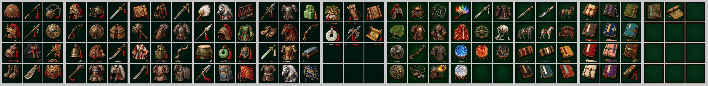

# 07. 보물 아이콘

- **대상:** 보물 도감·정비·보상 화면의 보물 그림
- **파일:**
  - 첫 60점: `packages/web/public/treasures-v2.webp` (971×1619, 6×10)
  - 추가 132칸: `treasures-extra-01~06-v1.webp`, `treasures-koei-01~02-v1.webp`, `treasures-unique-01~03-v1.webp` (각 816×1088, 3×4)
- **연결 코드:** `packages/web/src/treasure-art.ts` (`background-size:300% 400%`로 칸 하나를 그대로 보여 준다)

## 규격

| 항목 | 기준 |
|---|---|
| 추가 그림판 크기 | **816×1088**, 3열 × 4행, 칸 **272×272** |
| 칸 배경 | 짙은 초록·먹색 단색. 판 전체가 같은 색 |
| 여백 | 그림은 칸 가운데, 사방 **12px 이상** 띄운다 |
| 옆 칸 침범 | **금지.** 칸 밖으로 나간 부분을 지우면 옆 칸에 조각이 남는다. 처음부터 칸 안에 들어오게 그린다 |
| 빈 칸 | 판 마지막의 남는 칸은 배경만 칠한다 |
| 화풍 | 채색 유화풍, 금속은 황동·금, 장식 술은 붉은색. 176점 모두 같은 조명 방향(왼쪽 위) |

- **그림이 없는 보물:** 형태 글자를 넣은 등급 테두리 패로 대신한다. 코드가 처리한다.

## 원칙
- 도감에서는 아이콘을 크게 본다. 가장자리의 작은 조각도 눈에 띈다.
- 칸 하나만 잘라 봐도 그 보물 하나만 보여야 한다.

## 현재 상태 (008b4db)

> **수정 반영 (main 0c2cb84):** 11장 모두에서 칸 가장자리 70px 안의 떨어진 조각을 같은 열의 배경으로 덮었다. 칸별로 잘라 본 일람에서 쓰는 칸의 조각은 모두 사라졌다.
> - **남은 것:** 쓰지 않는 빈 칸(extra-06 셋째 줄)의 조각은 남겨 두었다. 게임에 나오지 않는다.
> - **남은 것:** 아래 칸 보물의 윗부분이 이전에 잘려 나간 것은 되살릴 수 없다. 술·장식 끝이 조금 짧다.
> - 새 그림판은 규격(칸 안에 사방 12px 여백)대로 처음부터 그려야 한다.
- 그림 화풍은 176점 모두 고르다.
- 칸 경계선 자체에 걸친 그림은 0칸이다.
- **그러나** 칸을 하나씩 잘라 보면, 아래 칸 보물의 윗부분(술·장식 끝)이 위 칸 아래쪽에 떨어진 조각으로 남아 있다. 이전에 넘친 부분을 경계선에서만 지웠기 때문이다. 그래서 아래 칸 보물은 윗부분이 잘려 있다.

## 남은 위반: 옆 칸 조각 (중간)

자동 검사로 132칸 중 **약 39칸**에서 확인했다(가장자리 쪽에 본체와 떨어진 조각이 있는 칸).

| 그림판 | 조각 있는 칸 (행·열, 0부터) |
|---|---|
| extra-01 | 00, 10, 11, 12, 20, 21, 22 (7칸) |
| extra-02 | 20, 21, 22 |
| extra-03 | 00, 10, 12, 20, 21, 22 (6칸) |
| extra-04 | 20, 21, 22 |
| extra-05 | 20, 21, 22 |
| extra-06 | 10, 11 (위쪽, 확인 필요) |
| koei-01 | 20, 22 |
| koei-02 | 20 |
| unique-01 | 20, 21, 22 |
| unique-02 | 00~22 전부 (9칸, 병서 판) |
| unique-03 | 없음 |

- 특히 3행(맨 아래 줄)의 위 칸, 즉 2행 칸의 아래쪽에 많다.
- **고치는 방법:** 해당 판을 칸마다 다시 배치한다. 각 보물을 칸 가운데로 옮기고 사방 12px을 띄운다. 크기를 줄여서라도 칸 안에 넣는다.

## 검수 방법
1. 각 그림판을 272×272 칸으로 잘라, 칸 사이에 틈을 두고 한 장에 늘어놓는다(게임 아이콘과 같은 모양).
2. 칸마다 배경색과 다른 화소를 찾아 아래를 확인한다.
   - 가장자리 12px 띠 안에 그림이 없어야 한다.
   - 본체와 떨어진 작은 덩어리(조각)가 없어야 한다.
3. 도감 화면에서 확대 보기로 몇 개를 눈으로 확인한다.
